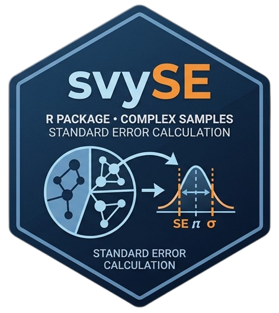

<!-- README.md is generated from README.Rmd. Please edit that file -->

# svySE 

<!-- badges: start -->

[](https://github.com/lburgoss/svySE/actions/workflows/R-CMD-check.yaml)
[](https://cran.r-project.org/package=svySE)
[](https://cran.r-project.org/package=svySE)
[](https://opensource.org/licenses/MIT)

<!-- badges: end -->

## Sampling Error Estimation for Complex Surveys

## Version Status

| Release channel | Version | Status |
|-----------------|---------|--------|
| [CRAN](https://CRAN.R-project.org/package=svySE) | `0.2.0` | Stable |
| [GitHub](https://github.com/lburgoss/svySE) | `0.3.0` | Development |

> The CRAN release is recommended for regular use. The GitHub development
> version may include new features and improvements that are still under
> active testing.

`svySE` is an R package for estimating sampling errors, producing descriptive indicator tables, and exporting structured results from complex survey data.

The package provides two complementary workflows:

- `svySE_calc()` calculates weighted estimates and sampling errors using the survey design.
- `svySE_simple()` calculates unweighted frequencies and percentages, expanded frequencies, or both, without sampling errors.

Results can be exported individually or consolidated across multiple datasets, survey weights, indicators, or analysis runs using `svySE_xlsx()`.

`svySE` is built on top of the **survey** package and provides a higher-level workflow for the routine production of survey indicators while preserving the principles of design-based estimation.

---

## Why svySE?

Survey indicator production often involves repeating the same technical steps:

1. preparing indicator variables;
2. identifying grouping and domain variables;
3. defining the survey design;
4. calculating weighted estimates;
5. estimating standard errors and confidence intervals;
6. calculating CV and DEFF;
7. preparing descriptive tables;
8. exporting results to structured workbooks.

`svySE` organizes these tasks into a reproducible and configurable workflow.

The package is designed to be:

- reproducible;
- flexible;
- easy to configure;
- suitable for repeated indicator production;
- compatible with complex survey designs;
- useful for official statistics;
- useful for academic and applied research;
- suitable for analyses involving multiple datasets or expansion factors.

Although the package was developed from practical experience in survey sampling and official statistics, it can be used by any researcher, analyst, public institution, national statistical office, or survey practitioner working with indicator-based survey data.

---

## Main Features

- Weighted totals
- Weighted proportions
- Standard errors
- Confidence intervals
- Wald and logit (`xlogit`) confidence intervals for proportions
- Coefficients of variation
- Design effects
- Unweighted sample sizes
- Grouped estimates
- Domain estimates
- Optional strata variables
- Optional cluster variables
- Unstratified designs
- Unclustered designs
- Unweighted simple indicator tables
- Weighted expanded-frequency tables without sampling errors
- Combined expanded and unexpanded counts
- Configurable missing-value handling in simple indicator tables
- Flexible column selection
- Consolidated export of multiple analyses
- Selective export of chosen results
- Customizable `.xlsx` outputs

---

## Package Workflow

| Step | Function | Purpose |
|------|----------|---------|
| **1** | `svySE_cfg()` | Configure estimation settings, confidence level, target category, CV, DEFF, and other options. |
| **2A** | `svySE_calc()` | Calculate weighted estimates and sampling errors using the survey design. |
| **2B** | `svySE_simple()` | Calculate unweighted tables, expanded frequencies, or both, without sampling errors. |
| **3** | `svySE_xlsx()` | Export one or multiple results to `.xlsx` files. |

The two calculation functions have separate responsibilities:

| Function | Uses weights | Uses survey design | Main output |
|----------|:------------:|:------------------:|-------------|
| `svySE_calc()` | Yes | Yes | Weighted estimates and sampling errors |
| `svySE_simple()` | Optional | No | Unweighted tables, expanded frequencies, or both |

Simple indicator tables also provide explicit control over missing indicator
values through the `na_rm` argument. Missing values can be excluded from the
calculation or treated as a validation condition that stops the analysis.

This separation avoids redundant calculations and allows users to run only the workflow required for each analysis.

---

## Installation

### Stable version from CRAN

```r
install.packages("svySE")
```

### Development version from GitHub

```r
install.packages("remotes")

remotes::install_github("lburgoss/svySE")
```

The CRAN version is recommended for regular use. The GitHub version may contain features under development before they are submitted to CRAN.

Load the package with:

```r
library(svySE)
```

---

## Example Data

The following simulated dataset contains:

- a geographic grouping variable;
- a stratification variable;
- a cluster variable;
- a sampling weight;
- a division variable;
- two binary indicators.

```r
library(svySE)

set.seed(123)

df <- data.frame(
  dept = rep(c("A", "B", "C"), each = 50),
  strata = rep(c("S1", "S2", "S3"), each = 50),
  cluster = rep(1:30, each = 5),
  service = rep(c("S1", "S2"), length.out = 150),
  weight = runif(150, 10, 50),
  ind_1 = sample(c(0, 1), 150, replace = TRUE),
  ind_2 = sample(c(0, 1), 150, replace = TRUE)
)

head(df)
```

---

## Configure the Analysis

`svySE_cfg()` defines the common settings used during sampling error estimation.

```r
cfg <- svySE_cfg(
  estimator = "prop",
  variance = "taylor",
  lonely_psu = "adjust",
  conf_level = 0.95,
  target = 1,
  valid_values = c(0, 1),
  truncate_lower_ci = TRUE,
  pct_mult = 100,
  deff = TRUE,
  cv = TRUE,
  na_rm = TRUE,
  ci_method = "wald",
  ci_df = NULL
)

cfg
```

The most relevant options are:

| Argument | Description |
|----------|-------------|
| `estimator` | Estimator used in the analysis, such as `"prop"` or `"total"`. |
| `variance` | Variance estimation method. |
| `lonely_psu` | Treatment of strata containing a single PSU. |
| `conf_level` | Confidence level used for interval estimation. |
| `target` | Indicator category treated as the target value. |
| `valid_values` | Values considered valid for the indicator. |
| `truncate_lower_ci` | Whether lower confidence limits are truncated at zero. |
| `pct_mult` | Multiplier used to express percentages. |
| `deff` | Whether design effects are calculated. |
| `cv` | Whether coefficients of variation are calculated. |
| `na_rm` | Whether missing values are removed during estimation. |
| `ci_method` | Confidence interval method for proportions: `"wald"` (default) or `"xlogit"`. |
| `ci_df` | Degrees of freedom for the `"xlogit"` interval. `NULL` uses the design degrees of freedom. |

---

## Calculate Sampling Errors

`svySE_calc()` estimates weighted indicators and sampling errors using the survey design.

```r
res_error <- svySE_calc(
  data = df,
  indicators = c("ind_1", "ind_2"),
  group_vars = "dept",
  group_labels = "Department",
  strata = "strata",
  cluster = "cluster",
  weight = "weight",
  division = NULL,
  div_weight = NULL,
  cfg = cfg,
  verbose = FALSE
)

res_error
```

The result is an object of class:

```r
class(res_error)
```

A specific sampling error table can be inspected with:

```r
res_error$results$ind_1$error$TOTAL
```

The output may contain:

| Column | Description |
|--------|-------------|
| `est_abs` | Weighted absolute estimate |
| `est_pct` | Weighted percentage estimate |
| `se_abs` | Standard error of the absolute estimate |
| `se_pct` | Standard error of the percentage |
| `ci_l_abs` | Lower confidence limit for the absolute estimate |
| `ci_l_pct` | Lower confidence limit for the percentage |
| `ci_u_abs` | Upper confidence limit for the absolute estimate |
| `ci_u_pct` | Upper confidence limit for the percentage |
| `cv` | Coefficient of variation |
| `deff` | Design effect |
| `n_unw` | Unweighted count of target cases |

## Confidence Intervals for Proportions

Starting with version 0.3.0, `svySE` offers two methods to build the
confidence intervals of proportions (`ci_l_pct` and `ci_u_pct`). The method is
selected with the `ci_method` argument of `svySE_cfg()`.

| Method | `ci_method` | Interval | Critical value |
|--------|-------------|----------|----------------|
| Wald (default) | `"wald"` | `p ± z × SE` | Normal quantile |
| Logit | `"xlogit"` | `expit(logit(p) ± t × SE / (p(1 − p)))` | `t` quantile with the design degrees of freedom |

Both methods use exactly the same estimate and the same Taylor-linearization
standard error. Only the construction of the interval changes: estimates,
standard errors, coefficients of variation, design effects, totals, and counts
are identical under both methods.

The logit interval is computed in four steps:

1. The proportion is transformed to the logit scale: `logit(p) = log(p / (1 − p))`.
2. The standard error is transferred to that scale with the delta method: `SE_logit = SE / (p(1 − p))`.
3. The limits are computed as `logit(p) ± t(1 − α/2, df) × SE_logit`.
4. The limits are transformed back to the 0–1 scale with `expit(x) = 1 / (1 + exp(−x))`.

Main properties of the logit interval:

- limits always remain within `[0, 1]`, without truncation;
- the interval is asymmetric around `p` when the proportion is close to 0 or 1;
- intervals of complementary categories are complementary: the interval of `1 − p` is `[1 − upper, 1 − lower]`;
- the critical value uses a `t` distribution with the design degrees of freedom (number of PSUs minus number of strata; without clusters, number of observations minus number of strata);
- domains use the degrees of freedom of the full design, not those of the domain.

The logit interval is recommended for small or large proportions and for
domains with few cases, where the Wald interval may produce limits outside
`[0, 1]`.

### Use the logit interval

```r
cfg_xlogit <- svySE_cfg(
  estimator = "prop",
  ci_method = "xlogit"
)

res_xlogit <- svySE_calc(
  data = df,
  indicators = c("ind_1", "ind_2"),
  group_vars = "dept",
  group_labels = "Department",
  strata = "strata",
  cluster = "cluster",
  weight = "weight",
  cfg = cfg_xlogit,
  verbose = FALSE
)

res_xlogit$results$ind_1$error$TOTAL
```

### Compare both methods

```r
wald <- res_error$results$ind_1$error$TOTAL
xlogit <- res_xlogit$results$ind_1$error$TOTAL

data.frame(
  dept = wald$dept,
  est_pct = wald$est_pct,
  se_pct = wald$se_pct,
  wald_lower = wald$ci_l_pct,
  wald_upper = wald$ci_u_pct,
  xlogit_lower = xlogit$ci_l_pct,
  xlogit_upper = xlogit$ci_u_pct
)
```

### Degrees of freedom

By default (`ci_df = NULL`), the critical value uses the design degrees of
freedom, which can be inspected with `survey::degf()`:

```r
design <- survey::svydesign(
  ids = ~cluster,
  strata = ~strata,
  weights = ~weight,
  data = df,
  nest = TRUE
)

survey::degf(design)
```

The degrees of freedom can also be set explicitly with `ci_df`. Use
`ci_df = Inf` to apply the normal quantile.

```r
cfg_xlogit_df <- svySE_cfg(
  estimator = "prop",
  ci_method = "xlogit",
  ci_df = 30
)

cfg_xlogit_z <- svySE_cfg(
  estimator = "prop",
  ci_method = "xlogit",
  ci_df = Inf
)

cfg_xlogit_df
```

When `division` is used, each division is estimated with its own survey design,
so its degrees of freedom correspond to the records of that division. Use
`ci_df` if a common value is required.

### Complementary categories

With the logit interval, the interval of the complementary category is obtained
directly from the interval of the target category.

```r
res_0 <- svySE_calc(
  data = df,
  indicators = "ind_1",
  group_vars = "dept",
  strata = "strata",
  cluster = "cluster",
  weight = "weight",
  cfg = svySE_cfg(estimator = "prop", target = 0, ci_method = "xlogit"),
  verbose = FALSE
)

tab_1 <- res_xlogit$results$ind_1$error$TOTAL
tab_0 <- res_0$results$ind_1$error$TOTAL

all.equal(tab_0$ci_l_pct, 100 - tab_1$ci_u_pct)
all.equal(tab_0$ci_u_pct, 100 - tab_1$ci_l_pct)
```

### Special cases

| Situation | Logit interval |
|-----------|----------------|
| Proportion equal to 0 or 1 | Degenerate interval `[p, p]`, as with the Wald method |
| Standard error equal to 0 | Degenerate interval `[p, p]` |
| Missing estimate or standard error | `NA` limits |
| Degrees of freedom not positive | `NA` limits |
| Groups without observations | `NA` row, as with the Wald method |
| `estimator` other than `"prop"` | Not available; `svySE_cfg()` returns an error |

The confidence intervals of absolute estimates (`ci_l_abs`, `ci_u_abs`) always
use the Wald method.

---

## Supported Survey Designs

`svySE_calc()` supports several survey design structures.

| Design structure | `strata` | `cluster` |
|------------------|----------|-----------|
| Weight only | `NULL` | `NULL` |
| Stratified design | Variable name | `NULL` |
| Clustered design | `NULL` | Variable name |
| Stratified clustered design | Variable name | Variable name |

### Weight only

```r
res_weight <- svySE_calc(
  data = df,
  indicators = "ind_1",
  group_vars = "dept",
  group_labels = "Department",
  strata = NULL,
  cluster = NULL,
  weight = "weight",
  cfg = cfg,
  verbose = FALSE
)
```

### Stratified design

```r
res_strata <- svySE_calc(
  data = df,
  indicators = "ind_1",
  group_vars = "dept",
  group_labels = "Department",
  strata = "strata",
  cluster = NULL,
  weight = "weight",
  cfg = cfg,
  verbose = FALSE
)
```

### Clustered design

```r
res_cluster <- svySE_calc(
  data = df,
  indicators = "ind_1",
  group_vars = "dept",
  group_labels = "Department",
  strata = NULL,
  cluster = "cluster",
  weight = "weight",
  cfg = cfg,
  verbose = FALSE
)
```

### Stratified clustered design

```r
res_complex <- svySE_calc(
  data = df,
  indicators = "ind_1",
  group_vars = "dept",
  group_labels = "Department",
  strata = "strata",
  cluster = "cluster",
  weight = "weight",
  cfg = cfg,
  verbose = FALSE
)
```

---

## Domain Estimation

A division variable can be used to calculate separate results for its categories while retaining the design-based estimation workflow.

```r
res_domain <- svySE_calc(
  data = df,
  indicators = "ind_1",
  group_vars = "dept",
  group_labels = "Department",
  strata = "strata",
  cluster = "cluster",
  weight = "weight",
  division = "service",
  div_weight = NULL,
  cfg = cfg,
  verbose = FALSE
)
```

Available divisions can be inspected with:

```r
names(res_domain$results$ind_1$error)
```

When `div_weight` is supplied, that weight is used for the corresponding division estimates.

---

## Simple Indicator Tables

`svySE_simple()` creates descriptive indicator tables without calculating
standard errors, confidence intervals, CV, or DEFF.

It supports three output modes:

| `output` | Columns produced |
|----------|------------------|
| `"unweighted"` | `freq_0`, `pct_0`, `freq_1`, `pct_1`, `freq_total`, `pct_total` |
| `"weighted"` | `exp_0`, `exp_pct_0`, `exp_1`, `exp_pct_1`, `exp_total`, `exp_pct_total` |
| `"both"` | All unweighted and expanded columns |

### Unweighted frequencies and percentages

This is the default and preserves the original behavior:

```r
res_simple <- svySE_simple(
  data = df,
  indicators = c("ind_1", "ind_2"),
  group_vars = "dept",
  group_labels = "Department",
  output = "unweighted",
  target = 1,
  valid_values = c(0, 1),
  pct_mult = 100,
  na_rm = TRUE,
  verbose = FALSE
)

res_simple$results$ind_1$simple$TOTAL
```

### Expanded frequencies

Expanded frequencies are obtained by summing the specified weight within
categories 0, 1, and the valid total:

```r
res_expanded <- svySE_simple(
  data = df,
  indicators = "ind_1",
  group_vars = "dept",
  group_labels = "Department",
  weight = "weight",
  output = "weighted",
  verbose = FALSE
)

res_expanded$results$ind_1$simple$TOTAL
```

The result contains:

| Column | Description |
|--------|-------------|
| `exp_0` | Expanded frequency for category 0 |
| `exp_pct_0` | Weighted percentage for category 0 |
| `exp_1` | Expanded frequency for category 1 |
| `exp_pct_1` | Weighted percentage for category 1 |
| `exp_total` | Expanded total of valid indicator records |
| `exp_pct_total` | Total weighted percentage |

### Expanded and unexpanded counts together

```r
res_both <- svySE_simple(
  data = df,
  indicators = "ind_1",
  group_vars = "dept",
  group_labels = "Department",
  weight = "weight",
  output = "both",
  verbose = FALSE
)

res_both$results$ind_1$simple$TOTAL
```

By default, `na_rm = TRUE`. Missing indicator values are excluded from the
calculation, and groups without valid observations for a specific indicator are
omitted from that indicator table.

Use `na_rm = FALSE` to stop the calculation when missing indicator values are
present:

```r
svySE_simple(
  data = df,
  indicators = "ind_1",
  group_vars = "dept",
  na_rm = FALSE
)
```

Records with missing weights do not contribute to expanded frequencies. When
`output = "both"`, valid indicator records still contribute to the unweighted
columns.

> Unweighted frequencies describe the observed sample. Expanded frequencies
> are weighted totals. Neither mode in `svySE_simple()` calculates sampling
> errors.

---

## Simple Tables by Division

```r
res_simple_domain <- svySE_simple(
  data = df,
  indicators = "ind_1",
  group_vars = "dept",
  group_labels = "Department",
  division = "service",
  weight = "weight",
  output = "both",
  verbose = FALSE
)

names(res_simple_domain$results$ind_1$simple)
```

## Export Results to XLSX

`svySE_xlsx()` exports sampling error results, simple indicator tables, or both.

### Export one sampling error result

```r
file_err <- tempfile(fileext = ".xlsx")

svySE_xlsx(
  x = res_error,
  file_err = file_err,
  file_tab = NULL,
  cols_err = svySE_cols_err("full"),
  overwrite = TRUE
)

file.exists(file_err)
```

### Export one simple result

```r
file_tab <- tempfile(fileext = ".xlsx")

svySE_xlsx(
  x = res_simple,
  file_err = NULL,
  file_tab = file_tab,
  cols_tab = svySE_cols_tab("full"),
  overwrite = TRUE
)

file.exists(file_tab)
```

---

## Export Multiple Analyses

Multiple results generated from different datasets, indicators, survey weights, or function calls can be exported together.

```r
results <- list(
  Main_errors = res_error,
  Domain_errors = res_domain,
  Main_simple = res_simple,
  Domain_simple = res_simple_domain
)
```

Export all available results:

```r
file_err <- tempfile(fileext = ".xlsx")
file_tab <- tempfile(fileext = ".xlsx")

svySE_xlsx(
  x = results,
  file_err = file_err,
  file_tab = file_tab,
  cols_err = svySE_cols_err("full"),
  cols_tab = svySE_cols_tab("full"),
  overwrite = TRUE
)
```

`svySE_xlsx()` automatically identifies:

- objects generated by `svySE_calc()`;
- objects generated by `svySE_simple()`.

Sampling error tables are written to `file_err`, while simple indicator tables are written to `file_tab`.

---

## Export Selected Results

The `select` argument can be used to export only chosen elements from a named list.

```r
svySE_xlsx(
  x = results,
  select = c("Main_errors", "Domain_errors"),
  file_err = tempfile(fileext = ".xlsx"),
  file_tab = NULL,
  overwrite = TRUE
)
```

Export only simple tables:

```r
svySE_xlsx(
  x = results,
  select = c("Main_simple", "Domain_simple"),
  file_err = NULL,
  file_tab = tempfile(fileext = ".xlsx"),
  overwrite = TRUE
)
```

---

## Customize Exported Columns

### Sampling error columns

```r
svySE_cols_err("full")
```

A custom selection can be defined with:

```r
error_columns <- svySE_cols_err(
  type = "custom",
  cols = c(
    "est_pct",
    "se_pct",
    "ci_l_pct",
    "ci_u_pct",
    "cv",
    "deff",
    "n_unw"
  )
)
```

Use the selected columns during export:

```r
svySE_xlsx(
  x = res_error,
  file_err = tempfile(fileext = ".xlsx"),
  file_tab = NULL,
  cols_err = error_columns
)
```

### Simple table columns

Available profiles include:

```r
svySE_cols_tab("full")
svySE_cols_tab("unweighted")
svySE_cols_tab("target")
svySE_cols_tab("freq")
svySE_cols_tab("pct")
svySE_cols_tab("expanded")
svySE_cols_tab("expanded_freq")
svySE_cols_tab("expanded_pct")
svySE_cols_tab("counts")
svySE_cols_tab("percentages")
```

Export only sample and expanded counts:

```r
svySE_xlsx(
  x = res_both,
  file_err = NULL,
  file_tab = tempfile(fileext = ".xlsx"),
  cols_tab = svySE_cols_tab("counts")
)
```

A custom selection can be defined with:

```r
simple_columns <- svySE_cols_tab(
  type = "custom",
  cols = c(
    "freq_1",
    "pct_1",
    "exp_1",
    "exp_pct_1",
    "freq_total",
    "exp_total",
    "exp_pct_total"
  )
)

svySE_xlsx(
  x = res_both,
  file_err = NULL,
  file_tab = tempfile(fileext = ".xlsx"),
  cols_tab = simple_columns
)
```

When `cols_tab = NULL`, all columns available in each simple result are
exported automatically.


---

---

## Main Functions

| Function | Description |
|----------|-------------|
| `svySE_cfg()` | Configure sampling error estimation settings |
| `svySE_calc()` | Calculate weighted estimates and sampling errors |
| `svySE_simple()` | Calculate unweighted tables, expanded frequencies, or both |
| `svySE_xlsx()` | Export one or multiple results to `.xlsx` files |
| `svySE_cols_err()` | Select sampling error columns |
| `svySE_cols_tab()` | Select simple table columns |

---

## Output Types

| Output | Generated by | Weighted | Uses survey design | Typical use |
|--------|--------------|:--------:|:------------------:|-------------|
| Sampling error tables | `svySE_calc()` | Yes | Yes | Official statistics, complex surveys, technical reports |
| Simple indicator tables | `svySE_simple()` | Optional | No | Sample counts, expanded totals, and descriptive reporting |

---

## Technical Ecosystem

`svySE` integrates functionality from established R packages.

| Package | Role |
|---------|------|
| `survey` | Design-based estimation, standard errors, confidence intervals, CV, DEFF, and design degrees of freedom |
| `openxlsx` | Creation and formatting of `.xlsx` workbooks |
| `stats` | Statistical formulas, coefficients, and confidence intervals |
| `svySE` | Workflow for survey indicators, errors, tables, and export |

`svySE` does not replace `survey`. It provides a structured interface for repeated indicator production and export workflows built on top of its design-based estimation capabilities.

---

## Documentation

The package includes:

- a reference manual;
- function documentation;
- package vignettes;
- reproducible examples;
- unit tests.

Open the package help:

```r
help(package = "svySE")
```

Browse available vignettes:

```r
browseVignettes("svySE")
```

Open documentation for the principal functions:

```r
?svySE_cfg
?svySE_calc
?svySE_simple
?svySE_xlsx
```

---

## Development Status

Version 0.3.0 introduces:

- logit-transformed (`xlogit`) confidence intervals for proportions through `ci_method`;
- configurable degrees of freedom for the interval critical value through `ci_df`.

Version 0.2.1 introduced:

- optional cluster variables;
- support for unstratified and unclustered designs;
- the new `svySE_simple()` workflow;
- separation between weighted estimation and descriptive simple tables;
- consolidated export of multiple analyses;
- selective export through the `select` argument;
- customizable `.xlsx` workbooks.
- weighted expanded frequencies in `svySE_simple()`;
- combined expanded and unexpanded simple tables;
- additional simple-table column profiles and custom export;
- faster unclustered survey designs by avoiding unnecessary PSU nesting;

Future releases will focus on additional estimators, expanded quality indicators, more export options, and broader support for complex survey workflows.

---

## Author

**Luis Burgos**

Statistician • RENACYT Researcher (Peru)

Sampling Specialist

National Institute of Statistics and Informatics (INEI)

ENCAL — Public Expenditure Quality Monitoring Survey

The package was developed independently based on professional experience in complex survey sampling, official statistics, and statistical programming.

Email: lburgoss1996@gmail.com

Suggestions, bug reports, and feature requests are welcome through the GitHub issue tracker.

---

## License

MIT License