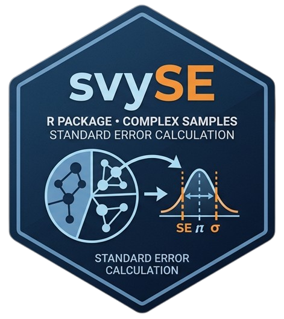

<p align="center">
  
</p>

# svySE

[](https://github.com/lburgoss/svySE/actions/workflows/R-CMD-check.yaml)


**Sampling Error Estimation for Complex Surveys**

`svySE` is an R package designed to estimate sampling errors and produce indicator tables from complex survey designs.

The package provides a reproducible workflow for calculating weighted totals, proportions, standard errors, confidence intervals, coefficients of variation (CV), design effects (DEFF), unweighted sample sizes, grouped estimates, domain estimates, and customizable Excel reports.

Built on top of the **survey** package, `svySE` simplifies the routine production of survey indicators while preserving the methodological principles of design-based estimation.

---

# Why svySE?

Many institutions and research teams repeatedly implement similar survey estimation procedures using custom scripts.

`svySE` was developed to standardize these procedures into a single workflow that is:

- Reproducible
- Flexible
- Easy to configure
- Methodologically consistent
- Suitable for official statistics
- Suitable for academic research
- Compatible with complex survey designs

Although initially developed from practical experience in official statistics, the package is intended for any researcher, public institution, national statistical office, or survey practitioner working with complex survey data.

---

# Main Features

✔ Complex survey estimation using the **survey** package

✔ Weighted totals

✔ Weighted proportions

✔ Standard errors

✔ Confidence intervals

✔ Coefficients of variation (CV)

✔ Design effects (DEFF)

✔ Unweighted sample sizes

✔ Grouped estimation

✔ Domain estimation

✔ Optional strata variables

✔ Optional cluster variables

✔ Configurable survey settings

✔ Customizable Excel exports

---

# Supported Survey Designs

`svySE` supports different survey design structures depending on the information available in the dataset.

| Design structure | `strata` | `cluster` |
|------------------|----------|-----------|
| Weight only | `NULL` | `NULL` |
| Stratified design | variable name | `NULL` |
| Clustered design | `NULL` | variable name |
| Stratified clustered design | variable name | variable name |

Examples:

```r
# Weight only
svySE_calc(
  data = df,
  indicators = "ind_1",
  group_vars = "dept",
  strata = NULL,
  cluster = NULL,
  weight = "weight",
  cfg = cfg
)

# Stratified design
svySE_calc(
  data = df,
  indicators = "ind_1",
  group_vars = "dept",
  strata = "strata",
  cluster = NULL,
  weight = "weight",
  cfg = cfg
)

# Clustered design
svySE_calc(
  data = df,
  indicators = "ind_1",
  group_vars = "dept",
  strata = NULL,
  cluster = "cluster",
  weight = "weight",
  cfg = cfg
)

# Stratified clustered design
svySE_calc(
  data = df,
  indicators = "ind_1",
  group_vars = "dept",
  strata = "strata",
  cluster = "cluster",
  weight = "weight",
  cfg = cfg
)
```

---

# Workflow

The typical `svySE` workflow consists of three steps:

<p align="center">
  
</p>

1. Configure the survey estimation settings with `svySE_cfg()`.
2. Calculate sampling errors with `svySE_calc()`.
3. Export the results to Excel with `svySE_xlsx()`.

---

# Installation

Development version:

```r
install.packages("remotes")

remotes::install_github("lburgoss/svySE")
```

---

# Basic Example

```r
library(svySE)

set.seed(123)

df <- data.frame(
  dept = rep(c("A", "B", "C"), each = 50),
  strata = rep(c("S1", "S2", "S3"), each = 50),
  cluster = rep(1:30, each = 5),
  weight = runif(150, 10, 50),
  ind_1 = sample(c(0, 1), 150, replace = TRUE)
)

cfg <- svySE_cfg(
  estimator = "prop",
  target = 1,
  valid_values = c(0, 1),
  lonely_psu = "adjust"
)

res <- svySE_calc(
  data = df,
  indicators = "ind_1",
  group_vars = "dept",
  group_labels = "Department",
  strata = "strata",
  cluster = "cluster",
  weight = "weight",
  cfg = cfg
)

print(res)
```

---

# Export Results

```r
tmp_err <- tempfile(fileext = ".xlsx")
tmp_tab <- tempfile(fileext = ".xlsx")

svySE_xlsx(
  x = res,
  file_err = tmp_err,
  file_tab = tmp_tab,
  cols_err = svySE_cols_err("full"),
  cols_tab = svySE_cols_tab("full")
)
```

---

# Main Functions

| Function | Description |
|----------|-------------|
| `svySE_cfg()` | Configure survey estimation settings |
| `svySE_calc()` | Calculate sampling errors |
| `svySE_xlsx()` | Export results to Excel |
| `svySE_cols_err()` | Select error table columns |
| `svySE_cols_tab()` | Select simple table columns |

---

# Output Tables

`svySE` produces two main types of outputs:

| Output | Description |
|--------|-------------|
| Error table | Weighted estimates, percentages, standard errors, confidence intervals, CV, DEFF, and unweighted counts |
| Simple table | Unweighted frequencies and percentages for indicator categories |

The exported Excel files can be customized by selecting the columns to include:

```r
svySE_cols_err("full")
svySE_cols_tab("full")
```

---

# Documentation

The package includes:

- Reference manual
- Package vignettes
- Function documentation
- Reproducible examples
- Unit tests

Complete documentation is available directly in R:

```r
help(package = "svySE")
```

or:

```r
browseVignettes("svySE")
```

---

# Development Status

`svySE` is under active development.

Version `0.2.0` adds support for optional cluster variables and more flexible survey design structures. Future releases will incorporate additional estimators and reporting utilities while maintaining compatibility with the **survey** package.

---

# Author

**Luis Burgos**

Statistician • RENACYT Researcher (Peru)

Sampling Specialist

National Institute of Statistics and Informatics (INEI)

ENCAL — Public Expenditure Quality Monitoring Survey

The package was developed independently based on professional experience in complex survey sampling, official statistics, and statistical programming.

📧 lburgoss1996@gmail.com

Suggestions, bug reports, and feature requests are welcome through the GitHub issue tracker.

---

# License

MIT License